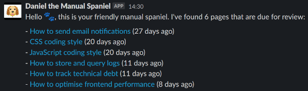
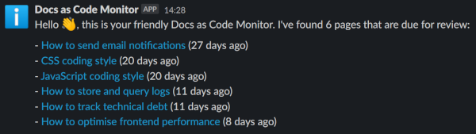

# Tech Docs Template - page expiry notifier

This repo is part of the [tech-docs-template][template], and is used in
conjunction with the [page expiry feature][expiry] that is part of the
[tech-docs-gem][gem]

Concourse CI will run the script once a day during weekdays.
It will look at the pages API for your site, find all pages that have expired, and post a Slack message to the owner of each page to let them know that it needs reviewing.

[template]: https://github.com/alphagov/tech-docs-template
[expiry]: https://alphagov.github.io/tech-docs-manual/#last-reviewed-on-and-review-in
[gem]: https://github.com/alphagov/tech-docs-gem

## Usage

### `alphagov` users

If you are part of the `alphagov` GitHub organisation you can enable the notifier by raising a PR to add your published documentation to the [`Rakefile`][Rakefile]:

```
pages_urls = [
  "https://gds-way.cloudapps.digital/api/pages.json",
  "https://docs.publishing.service.gov.uk/api/pages.json",
  "your-docs-site.cloudapps.digital"
]
```

If you want to limit the number of links that are posted to Slack after a single run, add this to  `limits` in the [`Rakefile`][Rakefile]

```
limits = {
  "your-docs-site.cloudapps.digital" => 3
}
```

The default behaviour is no limit, and the Slack message will contain all pages discovered.

[Rakefile]: https://github.com/alphagov/tech-docs-monitor/blob/master/Rakefile

### General configuration

The following environment variables are necessary:

* `SLACK_WEBHOOK_URL`: The Slack webhook URL to allow messages to be posted.
* `REALLY_POST_TO_SLACK`: Messages will only be posted to Slack if the value of
  this var is `1`.

#### Slack message customisation

This is the default Slack message when pages expire:



You can customise parts of the Slack message by configuring environment variables. The environment variables you can customise are:

| Environment variable name     | Purpose                                                         | Default value                                                                          |
|-------------------------------|-----------------------------------------------------------------|----------------------------------------------------------------------------------------|
| OVERRIDE_SLACK_MESSAGE_PREFIX | Sets a custom message prefix.                                   | "Hello :paw_prints:, this is your friendly manual spaniel."                            |
| OVERRIDE_SLACK_CHANNEL        | Sets a single Slack channel to which all messages will be sent. | The owning Slack channel for each page reported in the site's /api/pages.json endpoint |
| OVERRIDE_SLACK_USERNAME       | Sets the username to which Slack messages are attributed.       | "Daniel the Manual Spaniel"                                                            |
| OVERRIDE_SLACK_ICON_EMOJI     | Sets the icon emoji attributed to Slack messages.               | ":daniel-the-manual-spaniel:"                                                          |

This is an example of a customised Slack message:



## AWS Lambda

It is possible to run the tech-docs-monitor as an AWS Lambda, this is facilitated by the following `lambda:local` and `lambda:publish` Rake tasks. The Lambda tasks use [AWS SAM CLI](https://docs.aws.amazon.com/serverless-application-model/latest/developerguide/serverless-sam-cli-install.html) so this must be installed as a pre-requisite to running the tasks.

### Running the Lambda locally

Create an JSON file containing the event you would like to pass to the Lambda e.g.

`example-event.json`:

```json
{
  "run_expired_page_check": true,
  "run_expire_by_page_check": true,
  "page_urls": [
    "https://www.docs.verify.service.gov.uk/api/pages.json",
    "https://gds-way.cloudapps.digital/api/pages.json"
  ]
}
```

Invoke the `lambda:local` Rake task, passing the path to the event-file as a task parameter e.g.

```shell
bundle exec rake lambda:local\[example-event.json\]
```

The Lambda will build and run locally, sending its output to the shell.

### Building and publishing a Lambda artefact

To do this, run the `lambda:publish` Rake task with the following parameters:
1. The version to use in the published Lambda artefact filename.
2. The name of the S3 bucket in which to publish the Lambda artefact.
3. The S3 key prefix to fice the published Lambda artefact.

You must configure an AWS session which has access to the specified Bucket in order for this to work e.g. by using [aws-profile](https://github.com/jrstarke/aws-profile) or similar. 

```shell
aws-profile -p my-aws-profile bundle exec rake lambda:publish\[0.0.4,my-s3-bucket,aws-lambda-tech-docs-monitor\]
```

The example above would result in the artefact being published to `aws-lambda-tech-docs-monitor/aws-lambda-tech-docs-monitor-0.0.4.zip` in the `my-s3-bucket` S3 Bucket.

## Licence

The gem is available as open source under the terms of the [MIT License](LICENCE).
