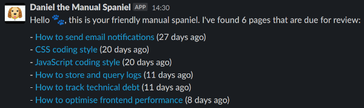
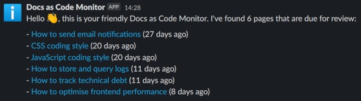

# Tech docs monitor

You can use the tech docs monitor to receive notifications when pages in your technical documentation are due for review.  To use the monitor you must:

- be part of the `alphagov` GitHub organisation
- have built your site using the [tech-docs-template][template]
- be using the [page expiry feature][expiry] in your pages
- have a Slack channel to receive notifications

The monitor is scheduled to run once a week on Wednesdays at 12:05.  This is managed via the GitHub actions found in `./github/workflows/run.yml`.

## Understand how to receive notifications

In order to receive notifications for expired pages you need to:

- add the correct [settings to your documentation](#set-up-the-monitor-in-your-documentation)
- add the link your `pages.json` [to this repository](#set-up-the-monitor-in-this-repository)

### Set up the monitor in your documentation

To allow the monitor to check your documentation, the `frontmatter` in your pages should include:

- a `review_by` date
- a `owner_slack` channel

You can check these settings by visiting `https://<YOUR_PIBLISHED_SITE>/api/pages.json`.  You should see something similar to the output below:

```json
[
  {
    "title": "Search",
    "url": "/search/",
    "review_by":"2020-01-01",
    "owner_slack": "#my-slack-channel"
  },
  ...
```

If you have not set these values you can use the global settings in `config/tech-docs.yml`.  For example:

```yaml

default_owner_slack: '#my-team-slack-channel'
owner_slack_workspace: 'gds'
```

### Add your documentation to the tech docs monitor

To add your documentation to the weekly job, you must add a link to your `pages.json` to the [`Rakefile`](Rakefile) in this repository.  

To add your link you open a pull request adding your link to the `pages_urls` list.  For example:

```diff
namespace :notify do
  pages_urls = [
    "https://gds-way.cloudapps.digital/api/pages.json",
    "https://docs.publishing.service.gov.uk/api/pages.json",
+   "https://<YOUR_PIBLISHED_SITE>/api/pages.json"
```

### Additional configurations

#### Notification limits
If you want to limit the number of links that are posted to Slack after a single run, add this to `limits` in the [`Rakefile`](Rakefile)

```
limits = {
  "your-docs-site.cloudapps.digital" => 3
}
```

The default behaviour is no limit, and the Slack message will contain all pages discovered.

#### Customise Slack messages

This is the default Slack message when pages expire:



You can customise parts of the Slack message by configuring environment variables. The environment variables you can customise are:

| Environment variable name     | Purpose                                                         | Default value                                                                          |
|-------------------------------|-----------------------------------------------------------------|----------------------------------------------------------------------------------------|
| OVERRIDE_SLACK_MESSAGE_PREFIX | Sets a custom message prefix.                                   | "Hello :paw_prints:, this is your friendly manual spaniel."                            |
| OVERRIDE_SLACK_CHANNEL        | Sets a single Slack channel to which all messages will be sent. | The owning Slack channel for each page reported in the site's /api/pages.json endpoint |
| OVERRIDE_SLACK_USERNAME       | Sets the username to which Slack messages are attributed.       | "Daniel the Manual Spaniel"                                                            |
| OVERRIDE_SLACK_ICON_EMOJI     | Sets the icon emoji attributed to Slack messages.               | ":daniel-the-manual-spaniel:"                                                          |

This is an example of a customised Slack message:




### GitHub actions environment variables

In order to run the scheduled job, the GitHub action in this repo must have the following environment variables:

- `SLACK_WEBHOOK_URL` - the Slack webhook URL to allow messages to be posted.
- `REALLY_POST_TO_SLACK` - messages will only be posted to Slack if the value of
  this var is `1`.

## Licence

The gem is available as open source under the terms of the [MIT License](LICENCE).

[template]: https://github.com/alphagov/tech-docs-template
[expiry]: https://alphagov.github.io/tech-docs-manual/#last-reviewed-on-and-review-in
[gem]: https://github.com/alphagov/tech-docs-gem